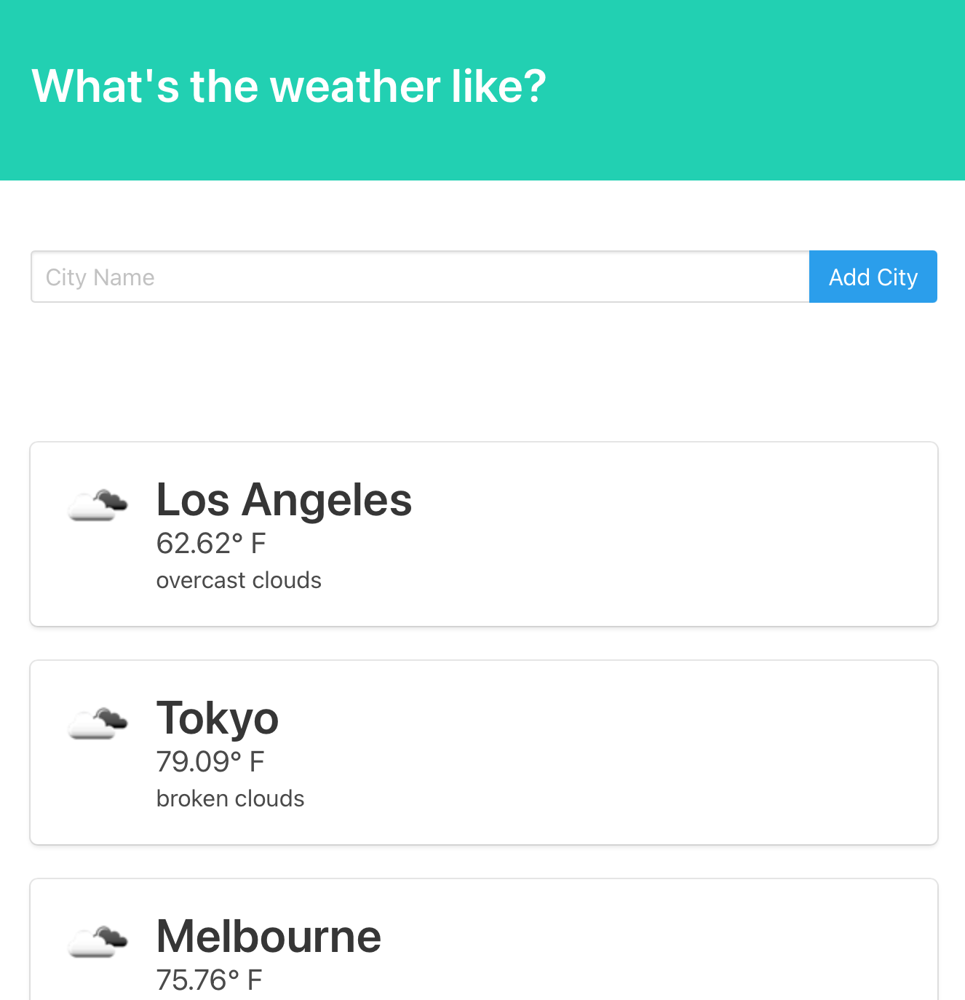

<h1 align="center">Django Weather App</h1>

  

<br />
## Description
🔍 Web app using OpenWeatherAPI to retrieve current weather from any Location in the world. Stores the City you search up within the list, Mobile First responsive design.
Click [Here](https://young-scrubland-99547.herokuapp.com) to launch App!
## Table of Contents
- [Description](#description)
- [License](#license)
- [Installation](#Installation)
- [Contributing](#contributing)
- [Tests](#Tests)
## Installation

```
pip install gunicorn
```

## Usage

```
python runserver manage.py
```

### Development
Want to contribute? Great!

To fix a bug or enhance an existing module, follow these steps:

- Fork the repo
- Create a new branch (`git checkout -b improve-feature`)
- Make the appropriate changes in the files
- Add changes to reflect the changes made
- Commit your changes (`git commit -am 'Improve feature'`)
- Push to the branch (`git push origin improve-feature`)
- Create a Pull Request 


## License

<br />
This application is covered by the MIT license. 
## Contributing
Eddie Ibarra
<br />
:octocat: Find me on GitHub: [ibarrasb](https://github.com/ibarrasb)<br />
<br />
✉Email me with any questions: eddieibarra43@gmail.com<br /><br />

    
